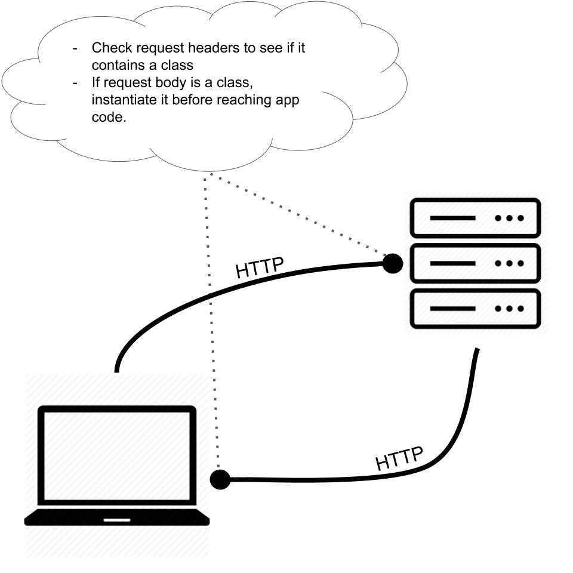

# Typescript Levelup Talk

## Fullstack Typescript app in 30 minutes

- Fullstack typescript app
- Front end: Angular
- Back end: NodeJS Express
- Monorepo management: NX

## Helpful Links for NX:
1. [Intro video](https://www.youtube.com/watch?v=mVKMse-gFBI)
1. [NX Overview](https://nx.dev/angular/cli/overview)
1. [Generate Command](https://nx.dev/angular/cli/generate)
1. [Info on Workspaces](https://nx.dev/angular/workspace/workspace-overview)

## App theme
Pets. We're going to be creating and instantiating Pets classes on the front end and back end.

### Diagram
